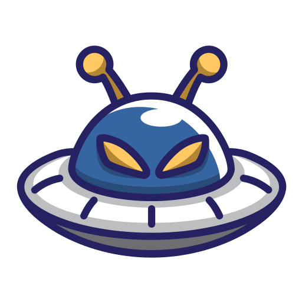

# Shoot The Alien



Shoot The Alien is an exciting mobile game developed for Android, where players can engage in thrilling space battles against alien invaders. This is the first release of the application, designed to deliver a captivating gaming experience.

## Features

- **Engaging Gameplay**: Experience thrilling missions and challenges as you battle against aliens.
- **User-Friendly Interface**: Navigate easily through the app with a clean and intuitive design.
- **Leaderboard**: Compete with friends and other players to achieve the highest scores.
- **Settings**: Customize your gaming experience with various settings options.

## Screenshots


## Getting Started

To get a copy of the project up and running on your local machine, follow these steps:

### Prerequisites

- Android Studio
- Java Development Kit (JDK) 8 or higher
- Android SDK

### Installation

1. Clone the repository:
   ```bash
   git clone https://github.com/ikhwanhanif/ShootTheAlien.git
2. Open the project in Android Studio.
3. Sync the project with Gradle files.
4. Run the app on an Android emulator or a physical device.

### Usage

1. Launch the app from your device.
2. Follow the on-screen instructions to start playing.
3. Explore the settings to customize your gameplay experience.

## Contributing

Contributions are welcome! If you have suggestions or improvements, please create a pull request or open an issue.

## License

This project is licensed under the MIT License - see the [LICENSE](LICENSE) file for details.

## Acknowledgments

- Special thanks to the open-source community for their contributions.
- Thank you for playing Shoot The Alien!
